# MCP Dataverse Server — Complete Capabilities Reference

> **Version**: 0.3.2 | **API Version**: Dataverse Web API v9.2 | **Transport**: stdio · HTTP/SSE

54 tools across 23 categories for full Dataverse lifecycle: schema, CRUD, FetchXML, solutions, plugins, audit, files, users, teams, environment variables, and more.

---

## Table of Contents

- [Quick Start](#quick-start)
- [Architecture Overview](#architecture-overview)
- [Tool Reference (54 tools)](#tool-reference-54-tools)
  - [1. Auth (1)](#1-auth-1-tool)
  - [2. Metadata (8)](#2-metadata-8-tools)
  - [3. Query (3)](#3-query-3-tools)
  - [4. CRUD (5)](#4-crud-5-tools)
  - [5. Relations (2)](#5-relations-2-tools)
  - [6. Actions & Functions (6)](#6-actions--functions-6-tools)
  - [7. Batch (1)](#7-batch-1-tool)
  - [8. Change Tracking (1)](#8-change-tracking-1-tool)
  - [9. Solutions (3)](#9-solutions-3-tools)
  - [10. Impersonation (1)](#10-impersonation-1-tool)
  - [11. Customization (3)](#11-customization-3-tools)
  - [12. Environment (2)](#12-environment-2-tools)
  - [13. Trace (2)](#13-trace-2-tools)
  - [14. Search (1)](#14-search-1-tool)
  - [15. Audit (1)](#15-audit-1-tool)
  - [16. Quality (1)](#16-quality-1-tool)
  - [17. Annotations (2)](#17-annotations-2-tools)
  - [18. Users (2)](#18-users-2-tools)
  - [19. Views (1)](#19-views-1-tool)
  - [20. Files (2)](#20-files-2-tools)
  - [21. Org (1)](#21-org-1-tool)
- [Error Handling & Retry Behavior](#error-handling--retry-behavior)
- [Security](#security)
- [Limitations & Known Constraints](#limitations--known-constraints)

---

## Quick Start

### Prerequisites

| Requirement               | Details                                                       |
| ------------------------- | ------------------------------------------------------------- |
| **Node.js**               | v20+                                                          |
| **Dataverse Environment** | Active URL (`https://<org>.crm<N>.dynamics.com`)              |
| **Authentication**        | Device code flow (interactive) via MSAL                       |

### Installation & Configuration

```bash
npm install && npm run build
```

Create `config.json` (see `config.example.json`):

```json
{
  "environmentUrl": "https://yourorg.crm.dynamics.com",
  "requestTimeoutMs": 30000,
  "maxRetries": 3
}
```

| Field                                    | Type            | Description                                             |
| ---------------------------------------- | --------------- | ------------------------------------------------------- |
| `environmentUrl`                         | `string`        | Dataverse environment URL (**required**, must be HTTPS) |
| `requestTimeoutMs`                       | `number`        | HTTP timeout ms (default: `30000`)                      |
| `maxRetries`                             | `number`        | Max retry attempts 0–10 (default: `3`)                  |

Env vars override config: `DATAVERSE_ENV_URL`, `REQUEST_TIMEOUT_MS`, `MAX_RETRIES`.

### Authentication

The server uses Microsoft’s device code flow (MSAL Public Client). On first launch, a sign-in code is displayed in the VS Code Output panel. Open `https://microsoft.com/devicelogin`, paste the code, and sign in with your Power Platform work account. Tokens are cached in `~/.mcp-dataverse/` (encrypted) and renewed automatically.

### Running

```bash
npm run start    # production
npm run dev      # watch mode
```

Server communicates over **stdio** (MCP SDK `StdioServerTransport`). Connect from any MCP host (VS Code Copilot, Claude Desktop, etc.) by configuring it to spawn the process.

---

## Architecture Overview

```mermaid
graph LR
    MCP["MCP Dataverse Server<br/><i>54 tools · 23 categories</i>"]

    MCP --> AUTH["🔑 Auth (1)"]
    MCP --> META["📋 Metadata (8)"]
    MCP --> QUERY["🔍 Query (3)"]
    MCP --> CRUD["✏️ CRUD (6)"]
    MCP --> REL["🔗 Relations (2)"]
    MCP --> ACT["⚡ Actions & Functions (6)"]
    MCP --> BATCH["📦 Batch (1)"]
    MCP --> TRACK["🔄 Change Tracking (1)"]
    MCP --> SOL["🧩 Solutions (3)"]
    MCP --> IMP["👤 Impersonation (1)"]
    MCP --> CUST["🔧 Customization (3)"]
    MCP --> ENV["⚙️ Environment (2)"]
    MCP --> TRACE["🔎 Trace (2)"]
    MCP --> SRCH["🔍 Search (1)"]
    MCP --> AUDIT["📜 Audit (1)"]
    MCP --> QUAL["✅ Quality (1)"]
    MCP --> NOTE["📝 Annotations (2)"]
    MCP --> USR["👥 Users (2)"]
    MCP --> VIEWS["👁️ Views (1)"]
    MCP --> FILES["📁 Files (2)"]
    MCP --> ORG["🏢 Org (1)"]
    MCP --> TEAMS["👥 Teams (1)"]
    MCP --> ASSIST["🤖 Assistance (4)"]
```



All tool handlers validate inputs with **Zod** before calling the `DataverseAdvancedClient`. Auth tokens are cached and refreshed proactively; transient errors (429, 503, 504) are retried with exponential backoff.

---

## Tool Reference (50 tools)

### 1. Auth (1 tool)

#### `dataverse_whoami`

Returns the current authenticated user context (userId, businessUnitId, organizationId, organizationName, environmentUrl). No parameters required.

> "Who am I in Dataverse?"

---

### 2. Metadata (8 tools)

#### `dataverse_list_tables`

Lists all Dataverse tables. Defaults to custom tables only; set `includeSystemTables=true` for all ~1700+ system tables.

| Parameter             | Type      | Req | Notes           |
| --------------------- | --------- | --- | --------------- |
| `includeSystemTables` | `boolean` | —   | Default `false` |

> "List all custom tables in my environment"

---

#### `dataverse_get_table_metadata`

Returns full schema for a table: column logical names, display names, data types, required levels, lookup targets. Set `includeAttributes=false` for table-level info only.

| Parameter           | Type      | Req | Notes            |
| ------------------- | --------- | --- | ---------------- |
| `logicalName`       | `string`  | ✓   | e.g. `"account"` |
| `includeAttributes` | `boolean` | —   | Default `true`   |

> "Show me the schema for the contact table"

---

#### `dataverse_get_relationships`

Returns 1:N, N:1, and N:N relationships for a table. Use to find the correct `relationshipName` for associate/disassociate.

| Parameter          | Type                                            | Req | Notes              |
| ------------------ | ----------------------------------------------- | --- | ------------------ |
| `logicalName`      | `string`                                        | ✓   | Table logical name |
| `relationshipType` | `"OneToMany"\|"ManyToOne"\|"ManyToMany"\|"All"` | —   | Default `"All"`    |

> "What relationships does the account table have?"

---

#### `dataverse_list_global_option_sets`

Lists all global (shared) option sets in the environment. No parameters required.

> "List all global option sets in my environment"

---

#### `dataverse_get_option_set`

Returns all labels and integer values for a named global option set.

| Parameter | Type     | Req | Notes                  |
| --------- | -------- | --- | ---------------------- |
| `name`    | `string` | ✓   | Global option set name |

> "Show me the values for the budgetstatus option set"

---

#### `dataverse_get_entity_key`

Returns alternate key definitions for a table: key attributes, index status (Active/InProgress/Failed), and customizability.

| Parameter   | Type     | Req | Notes              |
| ----------- | -------- | --- | ------------------ |
| `tableName` | `string` | ✓   | Table logical name |

> "What alternate keys are defined on the account table?"

---

#### `dataverse_get_attribute_option_set`

Returns all labels and integer values for a table-specific Picklist, Status, or State attribute. Use instead of `dataverse_get_option_set` for column-local choices.

| Parameter              | Type     | Req | Notes                                 |
| ---------------------- | -------- | --- | ------------------------------------- |
| `entityLogicalName`    | `string` | ✓   | e.g. `"account"`                      |
| `attributeLogicalName` | `string` | ✓   | e.g. `"statuscode"`, `"industrycode"` |

> "What are the valid statuscode values for opportunity?"

---

### 3. Query (3 tools)

#### `dataverse_query`

OData query with `$filter`, `$select`, `$orderby`, `$top`, `$expand`, `$count`, and `$apply` (aggregations).

| Parameter       | Type       | Req | Notes                           |
| --------------- | ---------- | --- | ------------------------------- |
| `entitySetName` | `string`   | ✓   | e.g. `"accounts"`               |
| `select`        | `string[]` | —   | Recommended — minimizes payload |
| `filter`        | `string`   | —   | OData `$filter` expression      |
| `orderby`       | `string`   | —   | OData `$orderby` expression     |
| `top`           | `number`   | —   | Default `50`, max `5000`        |
| `expand`        | `string`   | —   | OData `$expand`                 |
| `count`         | `boolean`  | —   | Include `@odata.count`          |

> "Show me the first 10 active accounts sorted by name"

---

#### `dataverse_execute_fetchxml`

Executes a FetchXML query — use for aggregations, complex joins, many-to-many traversal, and filters not expressible in OData.

| Parameter       | Type     | Req | Notes                                                |
| --------------- | -------- | --- | ---------------------------------------------------- |
| `fetchXml`      | `string` | ✓   | Complete FetchXML string                             |
| `entitySetName` | `string` | —   | Auto-extracted from `<entity name="...">` if omitted |

> "Run a FetchXML query to count opportunities grouped by status"

---

#### `dataverse_retrieve_multiple_with_paging`

Retrieves ALL matching records by auto-following `@odata.nextLink` pages. Use when > 5000 records are needed.

| Parameter       | Type       | Req | Notes                       |
| --------------- | ---------- | --- | --------------------------- |
| `entitySetName` | `string`   | ✓   | OData entity set name       |
| `select`        | `string[]` | —   | Columns to return           |
| `filter`        | `string`   | —   | OData `$filter`             |
| `orderby`       | `string`   | —   | OData `$orderby`            |
| `expand`        | `string`   | —   | OData `$expand`             |
| `maxTotal`      | `number`   | —   | Default `5000`, max `50000` |

> "Get all contacts with email addresses, up to 20000 records"

```json
{ "records": [...], "totalRetrieved": 12345, "pageCount": 3 }
```

---

### 4. CRUD (5 tools)

#### `dataverse_get`

Retrieves a single record by GUID. Returns the record plus `@odata.etag`.

| Parameter       | Type            | Req | Notes                 |
| --------------- | --------------- | --- | --------------------- |
| `entitySetName` | `string`        | ✓   | OData entity set name |
| `id`            | `string (UUID)` | ✓   | Record GUID           |
| `select`        | `string[]`      | —   | Columns to return     |

> "Get the account record with ID a1b2c3d4-..."

---

#### `dataverse_create`

Creates a new record and returns its GUID. Use `@odata.bind` for lookup fields.

| Parameter       | Type     | Req | Notes                                     |
| --------------- | -------- | --- | ----------------------------------------- |
| `entitySetName` | `string` | ✓   | OData entity set name                     |
| `data`          | `object` | ✓   | Field key-value pairs using logical names |

> "Create a new account called 'Fabrikam Inc.'"

---

#### `dataverse_update`

PATCH-updates an existing record (only supplied fields change). Sends `If-Match: *`.

| Parameter       | Type            | Req | Notes                 |
| --------------- | --------------- | --- | --------------------- |
| `entitySetName` | `string`        | ✓   | OData entity set name |
| `id`            | `string (UUID)` | ✓   | Record GUID           |
| `data`          | `object`        | ✓   | Fields to update      |

> "Update account a1b2c3d4 — set revenue to 5000000"

---

#### `dataverse_delete`

Permanently deletes a record. **Irreversible.** `confirm` must be `true`.

| Parameter       | Type            | Req | Notes                     |
| --------------- | --------------- | --- | ------------------------- |
| `entitySetName` | `string`        | ✓   | OData entity set name     |
| `id`            | `string (UUID)` | ✓   | Record GUID               |
| `confirm`       | `boolean`       | ✓   | Must be `true` to proceed |

> "Delete account record a1b2c3d4-..."

---

#### `dataverse_upsert`

Create-or-update via an alternate key (no GUID needed). Returns `"created"` or `"updated"`.

| Parameter           | Type                                   | Req | Notes                        |
| ------------------- | -------------------------------------- | --- | ---------------------------- |
| `entitySetName`     | `string`                               | ✓   | OData entity set name        |
| `alternateKey`      | `string`                               | ✓   | Alternate key attribute name |
| `alternateKeyValue` | `string`                               | ✓   | Value for the alternate key  |
| `data`              | `object`                               | ✓   | Record data                  |
| `mode`              | `"upsert"\|"createOnly"\|"updateOnly"` | —   | Default `"upsert"`           |

> "Upsert account with external ID 'EXT-001', set name to 'Contoso'"

```json
{
  "operation": "created",
  "id": "d4e5f6a7-...",
  "message": "Record created successfully"
}
```

---

### 5. Relations (2 tools)

#### `dataverse_associate`

Creates an N:N or 1:N association between two records via a named relationship.

| Parameter              | Type            | Req | Notes                    |
| ---------------------- | --------------- | --- | ------------------------ |
| `entitySetName`        | `string`        | ✓   | Source entity set        |
| `id`                   | `string (UUID)` | ✓   | Source record GUID       |
| `relationshipName`     | `string`        | ✓   | Relationship schema name |
| `relatedEntitySetName` | `string`        | ✓   | Related entity set       |
| `relatedId`            | `string (UUID)` | ✓   | Related record GUID      |

> "Associate contact c1d2e3f4 with account a1b2c3d4"

---

#### `dataverse_disassociate`

Removes an existing association. `relatedId` / `relatedEntitySetName` required for N:N.

| Parameter              | Type            | Req | Notes                    |
| ---------------------- | --------------- | --- | ------------------------ |
| `entitySetName`        | `string`        | ✓   | Source entity set        |
| `id`                   | `string (UUID)` | ✓   | Source record GUID       |
| `relationshipName`     | `string`        | ✓   | Relationship schema name |
| `relatedId`            | `string (UUID)` | —   | Required for N:N         |
| `relatedEntitySetName` | `string`        | —   | Required for N:N         |

> "Remove the association between account a1b2c3d4 and contact c1d2e3f4"

---

### 6. Actions & Functions (6 tools)

#### `dataverse_execute_action`

Executes a global (unbound) Dataverse action — state-changing, not tied to a specific record.

| Parameter    | Type     | Req | Notes                                         |
| ------------ | -------- | --- | --------------------------------------------- |
| `actionName` | `string` | ✓   | Action logical name (e.g. `"WinOpportunity"`) |
| `parameters` | `object` | —   | Action parameters (default `{}`)              |

> "Execute the WinOpportunity action"

---

#### `dataverse_execute_function`

Executes a global (unbound) OData function — read-only, no side effects.

| Parameter      | Type     | Req | Notes                               |
| -------------- | -------- | --- | ----------------------------------- |
| `functionName` | `string` | ✓   | e.g. `"RetrieveTotalRecordCount"`   |
| `parameters`   | `object` | —   | Key-value pairs serialized into URL |

> "Get total record count for the account entity"

---

#### `dataverse_execute_bound_action`

Executes an action bound to a specific record. Do **not** include the `Microsoft.Dynamics.CRM.` namespace prefix.

| Parameter       | Type            | Req | Notes                             |
| --------------- | --------------- | --- | --------------------------------- |
| `entitySetName` | `string`        | ✓   | OData entity set name             |
| `id`            | `string (UUID)` | ✓   | Record GUID                       |
| `actionName`    | `string`        | ✓   | Action name (no namespace prefix) |
| `parameters`    | `object`        | —   | Action parameters                 |

> "Qualify the lead l1m2n3o4 in Dataverse"

---

#### `dataverse_execute_bound_function`

Executes a read-only function bound to a specific record (e.g. `CalculateRollupField`).

| Parameter       | Type            | Req | Notes                               |
| --------------- | --------------- | --- | ----------------------------------- |
| `entitySetName` | `string`        | ✓   | OData entity set name               |
| `id`            | `string (UUID)` | ✓   | Record GUID                         |
| `functionName`  | `string`        | ✓   | Bound function name                 |
| `parameters`    | `object`        | —   | Key-value pairs serialized into URL |

> "Calculate the rollup field 'totalrevenue' on account a1b2c3d4"

---

#### `dataverse_list_dependencies`

Lists workflows, flows, business rules, and custom actions that reference a table. Use before modifying or removing a table.

| Parameter       | Type       | Req | Notes                                                                                              |
| --------------- | ---------- | --- | -------------------------------------------------------------------------------------------------- |
| `tableName`     | `string`   | ✓   | Table logical name                                                                                 |
| `componentType` | `string[]` | —   | Filter: `Workflow`, `Flow`, `BusinessRule`, `Action`, `BusinessProcessFlow`, `Plugin`, `CustomAPI` |

> "What workflows and flows reference the account table?"

---

#### `dataverse_retrieve_dependencies_for_delete`

Returns solution components that would block deletion of a component. Use before deleting customizations.

| Parameter       | Type            | Req | Notes                                                              |
| --------------- | --------------- | --- | ------------------------------------------------------------------ |
| `componentType` | `number`        | ✓   | Type code (1=Entity, 2=Attribute, 29=Workflow, 90=PluginAssembly…) |
| `objectId`      | `string (UUID)` | ✓   | Component GUID                                                     |

> "Check dependencies blocking deletion of workflow w1x2y3z4"

---

### 7. Batch (1 tool)

#### `dataverse_batch_execute`

Executes up to 1000 operations in a single `$batch` request. Set `useChangeset=true` to wrap mutations atomically (all-or-nothing rollback).

| Parameter           | Type                               | Req | Notes                                 |
| ------------------- | ---------------------------------- | --- | ------------------------------------- |
| `requests`          | `array`                            | ✓   | 1–1000 operation objects              |
| `requests[].method` | `"GET"\|"POST"\|"PATCH"\|"DELETE"` | ✓   | HTTP method                           |
| `requests[].url`    | `string`                           | ✓   | Relative URL, e.g. `"accounts(guid)"` |
| `requests[].body`   | `object`                           | —   | Body for POST/PATCH                   |
| `useChangeset`      | `boolean`                          | —   | Atomic changeset (default `false`)    |

> "Create 3 contacts in a single atomic batch"

```json
{ "results": [...], "count": 3 }
```

---

### 8. Change Tracking (1 tool)

#### `dataverse_change_detection`

Delta-query for incremental sync. Pass `deltaToken: null` for initial snapshot; use returned `nextDeltaToken` for subsequent calls. Requires change tracking enabled on the table.

| Parameter       | Type           | Req | Notes                   |
| --------------- | -------------- | --- | ----------------------- |
| `entitySetName` | `string`       | ✓   | OData entity set name   |
| `deltaToken`    | `string\|null` | ✓   | `null` for initial sync |
| `select`        | `string[]`     | —   | Columns to return       |

> "Get all changes to accounts since my last sync (token: abc123)"

```json
{ "newAndModified": [...], "deleted": [{"id":"..."}], "nextDeltaToken": "12345!..." }
```

---

### 9. Solutions (3 tools)

#### `dataverse_list_solutions`

Lists solutions in the environment. By default returns only **unmanaged** solutions.

| Parameter        | Type      | Req | Notes                                       |
| ---------------- | --------- | --- | ------------------------------------------- |
| `includeManaged` | `boolean` | —   | Include managed solutions (default `false`) |
| `nameFilter`     | `string`  | —   | Contains-match on unique name               |
| `top`            | `number`  | —   | Default `50`, max `200`                     |

> "List all unmanaged solutions in my environment"

```json
{
  "solutions": [
    { "uniqueName": "MySolution", "version": "1.0.0.0", "isManaged": false }
  ],
  "count": 1
}
```

---

#### `dataverse_solution_components`

Lists all components in a named solution. Use the **unique** solution name, not the display name.

| Parameter       | Type     | Req | Notes                                                                        |
| --------------- | -------- | --- | ---------------------------------------------------------------------------- |
| `solutionName`  | `string` | ✓   | Unique solution name                                                         |
| `componentType` | `number` | —   | Type code filter (1=Entity, 29=Workflow, 90=PluginAssembly, 97=WebResource…) |
| `top`           | `number` | —   | Default `200`, max `5000`                                                    |

> "List all entities in the 'MySolution' solution"

---

#### `dataverse_publish_customizations`

Publishes unpublished customizations. Omit `components` to publish all (equivalent to "Publish All" in maker portal). **Can take 30–120 s in large environments.**

| Parameter                 | Type       | Req | Notes                   |
| ------------------------- | ---------- | --- | ----------------------- |
| `components.entities`     | `string[]` | —   | Entity logical names    |
| `components.webResources` | `string[]` | —   | Web resource names      |
| `components.optionSets`   | `string[]` | —   | Global option set names |

> "Publish all pending customizations"

---

### 10. Impersonation (1 tool)

#### `dataverse_impersonate`

Executes any other tool on behalf of a different Dataverse user by injecting `MSCRMCallerId`. Applies only to the single wrapped call; cleaned up in `finally`. Requires `prvActOnBehalfOfAnotherUser`.

| Parameter  | Type            | Req | Notes                                         |
| ---------- | --------------- | --- | --------------------------------------------- |
| `callerId` | `string (UUID)` | ✓   | Azure AD Object ID of the user to impersonate |
| `toolName` | `string`        | ✓   | MCP tool name (e.g. `"dataverse_create"`)     |
| `toolArgs` | `object`        | ✓   | Arguments for the wrapped tool                |

> "Create a contact as user john@contoso.com (ID: u1v2w3x4-...)"

```json
{
  "impersonatedAs": "u1v2w3x4-...",
  "tool": "dataverse_create",
  "result": { "id": "..." }
}
```

---

### 11. Customization (3 tools)

#### `dataverse_list_custom_actions`

Lists all public SDK messages (custom APIs) registered in the environment.

| Parameter    | Type     | Req | Notes                           |
| ------------ | -------- | --- | ------------------------------- |
| `top`        | `number` | —   | Default `100`, max `500`        |
| `nameFilter` | `string` | —   | Substring match on message name |

> "List all custom actions registered in the environment"

```json
{
  "total": 5,
  "messages": [
    { "name": "new_MyAction", "category": "", "asyncSupported": true }
  ]
}
```

---

#### `dataverse_list_plugin_steps`

Lists plugin step registrations (SdkMessageProcessingStep): assembly, message, entity, stage (pre/post), mode (sync/async), and enabled state.

| Parameter           | Type      | Req | Notes                    |
| ------------------- | --------- | --- | ------------------------ |
| `top`               | `number`  | —   | Default `100`, max `500` |
| `activeOnly`        | `boolean` | —   | Default `true`           |
| `entityLogicalName` | `string`  | —   | Filter by entity         |

> "Show me all active plugin steps for the account entity"

---

#### `dataverse_set_workflow_state`

Activates or deactivates a classic Dataverse workflow (statecode/statuscode update).

| Parameter    | Type            | Req | Notes                               |
| ------------ | --------------- | --- | ----------------------------------- |
| `workflowId` | `string (UUID)` | ✓   | Workflow GUID                       |
| `activate`   | `boolean`       | ✓   | `true` = Activated, `false` = Draft |

> "Activate workflow w1x2y3z4"

```json
{
  "workflowId": "...",
  "newState": "Activated",
  "statecode": 1,
  "statuscode": 2
}
```

---

### 12. Environment (2 tools)

#### `dataverse_get_environment_variable`

Retrieves an environment variable's definition (type, default value) and current override value.

| Parameter    | Type     | Req | Notes                              |
| ------------ | -------- | --- | ---------------------------------- |
| `schemaName` | `string` | ✓   | Schema name, e.g. `"new_MyConfig"` |

> "What is the current value of environment variable new_ApiEndpoint?"

```json
{
  "schemaName": "new_ApiEndpoint",
  "typeName": "String",
  "defaultValue": "https://...",
  "currentValue": "https://override...",
  "effectiveValue": "https://override..."
}
```

---

#### `dataverse_set_environment_variable`

Sets or updates an environment variable's current value (creates or updates the value record).

| Parameter    | Type     | Req | Notes                                   |
| ------------ | -------- | --- | --------------------------------------- |
| `schemaName` | `string` | ✓   | Schema name of the environment variable |
| `value`      | `string` | ✓   | New value to set                        |

> "Set environment variable new_FeatureFlag to 'true'"

---

### 13. Trace (2 tools)

#### `dataverse_get_plugin_trace_logs`

Retrieves plugin execution trace logs: type name, triggering message, entity, duration, trace output, and exception details. Requires Plugin Trace Log enabled in Dataverse settings.

| Parameter          | Type      | Req | Notes                                         |
| ------------------ | --------- | --- | --------------------------------------------- |
| `top`              | `number`  | —   | Default `50`, max `200`                       |
| `pluginTypeFilter` | `string`  | —   | Substring match on type name                  |
| `messageFilter`    | `string`  | —   | e.g. `"Create"`, `"Update"`                   |
| `entityFilter`     | `string`  | —   | Entity logical name                           |
| `exceptionsOnly`   | `boolean` | —   | Only traces with exceptions (default `false`) |

> "Show me recent plugin failures on the account table"

---

#### `dataverse_get_workflow_trace_logs`

Retrieves AsyncOperation records for background/classic workflow executions. Not for modern cloud flows (use Power Automate portal for those).

| Parameter      | Type      | Req | Notes                                    |
| -------------- | --------- | --- | ---------------------------------------- |
| `top`          | `number`  | —   | Default `50`, max `200`                  |
| `failedOnly`   | `boolean` | —   | Only failed executions (default `false`) |
| `entityFilter` | `string`  | —   | Filter by regarding entity type          |

> "Show me failed classic workflows for the last 50 executions"

---

### 14. Search (1 tool)

#### `dataverse_search`

Full-text Relevance Search across all configured Dataverse tables. Returns ranked results with entity name, record ID, score, highlights, and matched fields. Requires **Relevance Search** enabled in Dataverse admin.

| Parameter    | Type               | Req | Notes                                               |
| ------------ | ------------------ | --- | --------------------------------------------------- |
| `query`      | `string`           | ✓   | Search string; Lucene syntax with `searchType=full` |
| `entities`   | `string[]`         | —   | Restrict to specific tables                         |
| `top`        | `number`           | —   | Default `10`, max `50`                              |
| `searchMode` | `"any"\|"all"`     | —   | Match any/all terms (default `"any"`)               |
| `searchType` | `"simple"\|"full"` | —   | Default `"simple"`                                  |
| `filter`     | `string`           | —   | OData `$filter` on results                          |
| `facets`     | `string[]`         | —   | Fields for faceted counts                           |
| `orderby`    | `string[]`         | —   | Sort fields, e.g. `["@search.score desc"]`          |
| `select`     | `string[]`         | —   | Fields to return per result                         |

> "Find all records mentioning 'Contoso' across accounts and contacts"

```json
{
  "totalRecordCount": 12,
  "results": [{ "entityName": "account", "objectId": "...", "score": 0.9 }]
}
```

---

### 15. Audit (1 tool)

#### `dataverse_get_audit_log`

Retrieves audit log entries with operation type, user info, and parsed change data. At least one filter is recommended. Requires auditing enabled on the environment and table.

| Parameter           | Type            | Req | Notes                                                                                               |
| ------------------- | --------------- | --- | --------------------------------------------------------------------------------------------------- |
| `recordId`          | `string (UUID)` | —   | Specific record GUID                                                                                |
| `entityLogicalName` | `string`        | —   | Filter by entity type                                                                               |
| `userId`            | `string (UUID)` | —   | Filter by user                                                                                      |
| `fromDate`          | `string`        | —   | ISO 8601 date (entries on/after)                                                                    |
| `top`               | `number`        | —   | Default `50`, max `500`                                                                             |
| `operations`        | `string[]`      | —   | `"Create"`, `"Update"`, `"Delete"`, `"Activate"`, `"Deactivate"`, `"Share"`, `"Assign"`, `"Access"` |

> "Show me all updates to account a1b2c3d4 in the last week"

---

### 16. Quality (1 tool)

#### `dataverse_detect_duplicates`

Checks prospective record fields against existing records using Dataverse built-in duplicate detection rules.

| Parameter           | Type     | Req | Notes                                  |
| ------------------- | -------- | --- | -------------------------------------- |
| `entityLogicalName` | `string` | ✓   | Table to check, e.g. `"account"`       |
| `record`            | `object` | ✓   | Field values of the prospective record |
| `top`               | `number` | —   | Default `5`, max `20`                  |

> "Check if there's already an account named 'Contoso Ltd'"

```json
{
  "hasDuplicates": true,
  "duplicateCount": 1,
  "duplicates": [{ "accountid": "...", "name": "Contoso Ltd" }]
}
```

---

### 17. Annotations (2 tools)

#### `dataverse_get_annotations`

Retrieves notes and file attachments linked to a record. Set `includeContent=true` to fetch base64 file bodies (can be very large).

| Parameter        | Type            | Req | Notes                                    |
| ---------------- | --------------- | --- | ---------------------------------------- |
| `recordId`       | `string (UUID)` | ✓   | Parent record GUID                       |
| `includeContent` | `boolean`       | —   | Include `documentbody` (default `false`) |
| `top`            | `number`        | —   | Default `20`, max `100`                  |
| `mimeTypeFilter` | `string`        | —   | e.g. `"application/pdf"`                 |

> "Get all notes attached to account a1b2c3d4"

---

#### `dataverse_create_annotation`

Creates a note or file attachment linked to a Dataverse record. Provide `notetext` for a text note, `documentbody` (base64) for a file, or both.

| Parameter       | Type            | Req | Notes                                                   |
| --------------- | --------------- | --- | ------------------------------------------------------- |
| `recordId`      | `string (UUID)` | ✓   | Parent record GUID                                      |
| `entitySetName` | `string`        | ✓   | Parent entity set, e.g. `"accounts"`                    |
| `notetext`      | `string`        | —   | Text content (required if no `documentbody`)            |
| `subject`       | `string`        | —   | Note subject/title                                      |
| `filename`      | `string`        | —   | File name (for attachments)                             |
| `mimetype`      | `string`        | —   | MIME type, e.g. `"application/pdf"`                     |
| `documentbody`  | `string`        | —   | Base64-encoded file content (required if no `notetext`) |

> "Attach a PDF report to account a1b2c3d4"

---

### 18. Users (2 tools)

#### `dataverse_list_users`

Searches Dataverse system users by name or email. At least one of `search` or `businessUnitId` is required. Excludes application users and disabled users by default.

| Parameter                 | Type            | Req | Notes                                                        |
| ------------------------- | --------------- | --- | ------------------------------------------------------------ |
| `search`                  | `string`        | ✓\* | Full-name or email contains-search (_one of these required_) |
| `businessUnitId`          | `string (UUID)` | ✓\* | Restrict to a business unit                                  |
| `includeDisabled`         | `boolean`       | —   | Default `false`                                              |
| `includeApplicationUsers` | `boolean`       | —   | Default `false`                                              |
| `top`                     | `number`        | —   | Default `20`, max `100`                                      |

> "Find all users named 'John' in my environment"

---

#### `dataverse_get_user_roles`

Returns all security roles assigned to a system user.

| Parameter | Type            | Req | Notes            |
| --------- | --------------- | --- | ---------------- |
| `userId`  | `string (UUID)` | ✓   | System user GUID |

> "What security roles does user u1v2w3x4 have?"

```json
{
  "userId": "...",
  "fullname": "John Doe",
  "roles": [{ "name": "Sales Manager", "roleId": "..." }],
  "roleCount": 1
}
```

---

### 19. Views (1 tool)

#### `dataverse_list_views`

Lists saved (system) and optionally personal views for a Dataverse table, including view name, ID, default flag, query type, and description.

| Parameter           | Type      | Req | Notes                                     |
| ------------------- | --------- | --- | ----------------------------------------- |
| `entityLogicalName` | `string`  | ✓   | Table logical name, e.g. `"account"`      |
| `includePersonal`   | `boolean` | —   | Include personal views (default `false`)  |
| `top`               | `number`  | —   | Max per category, default `20`, max `100` |

> "List all system views for the account table"

```json
{
  "entityLogicalName": "account",
  "systemViews": [
    { "id": "...", "name": "Active Accounts", "isDefault": true }
  ],
  "systemViewCount": 5
}
```

---

### 20. Files (2 tools)

#### `dataverse_upload_file_column`

Uploads a file to a Dataverse **file-type column** on a record. File content must be base64-encoded.

| Parameter       | Type            | Req | Notes                                                   |
| --------------- | --------------- | --- | ------------------------------------------------------- |
| `entitySetName` | `string`        | ✓   | OData entity set name                                   |
| `recordId`      | `string (UUID)` | ✓   | Record GUID                                             |
| `columnName`    | `string`        | ✓   | File column logical name (alphanumeric/underscore only) |
| `fileContent`   | `string`        | ✓   | Base64-encoded file content                             |
| `fileName`      | `string`        | ✓   | File name including extension, e.g. `"report.pdf"`      |

> "Upload report.pdf to the attachment column on account a1b2c3d4"

```json
{
  "success": true,
  "recordId": "...",
  "columnName": "new_report",
  "fileName": "report.pdf",
  "sizeBytes": 204800
}
```

---

#### `dataverse_download_file_column`

Downloads a file from a Dataverse file-type column. Returns the file as a base64-encoded string with its name and size.

| Parameter       | Type            | Req | Notes                    |
| --------------- | --------------- | --- | ------------------------ |
| `entitySetName` | `string`        | ✓   | OData entity set name    |
| `recordId`      | `string (UUID)` | ✓   | Record GUID              |
| `columnName`    | `string`        | ✓   | File column logical name |

> "Download the attachment from account a1b2c3d4 column new_report"

```json
{
  "fileName": "report.pdf",
  "sizeBytes": 204800,
  "contentBase64": "JVBERi0x..."
}
```

---

### 21. Org (1 tool)

#### `dataverse_list_business_units`

Lists business units in the environment with name, ID, parent BU ID, disabled status, and creation date.

| Parameter         | Type      | Req | Notes                                  |
| ----------------- | --------- | --- | -------------------------------------- |
| `top`             | `number`  | —   | Default `50`, max `200`                |
| `includeDisabled` | `boolean` | —   | Include disabled BUs (default `false`) |

> "List all active business units in my Dataverse environment"

---

## Error Handling & Retry Behavior

All tool handlers return `{ isError: true, content: [{ type: "text", text: "Error: ..." }] }` on failure. Zod input validation runs before any network call.

### Retry Strategy

| Status              | Behavior                                      | Attempts                 |
| ------------------- | --------------------------------------------- | ------------------------ |
| **401**             | Invalidate token, retry once with fresh token | 1                        |
| **429 / 503 / 504** | Exponential backoff (`2^attempt × 1000ms`)    | `maxRetries` (default 3) |
| **Other**           | Throw immediately                             | 0                        |

Dataverse error bodies are formatted as `Dataverse error <code>: <message>`. Timeouts (`ECONNABORTED`) produce `Request timed out. Check your Dataverse environment URL.`

---

## Security

| Mode              | Flow                                              | Use Case               |
| ----------------- | ------------------------------------------------- | ---------------------- |
| **Device Code**   | MSAL Public Client → device code + silent refresh  | Local dev, interactive |

- `clientSecret` is never logged or returned in tool responses.
- Token cache is encrypted (AES-256-GCM) at `~/.mcp-dataverse/` and should not be shared.
- OData path segments use `esc()` (single-quote doubling) to prevent OData injection.
- `columnName` in file tools is validated against `/^[a-zA-Z0-9_]+$/` to prevent path traversal.
- `MSCRMCallerId` for impersonation is set per-call and cleaned up in a `finally` block regardless of outcome.
- `.msal-cache.json` should be in `.gitignore`. No HTTP endpoints are exposed (stdio only).

---

## Limitations & Known Constraints

### General

| Limitation                     | Details                                                                                 |
| ------------------------------ | --------------------------------------------------------------------------------------- |
| **Transport**                  | stdio only. Server must be spawned as a child process by the MCP host.                  |
| **Single environment**         | One Dataverse environment per server instance. Restart to switch.                       |
| **No streaming**               | Responses are complete JSON. Very large result sets may exceed AI model context limits. |
| **No real-time subscriptions** | Use `dataverse_change_detection` for polling-based incremental sync.                    |

### Query

| Limitation              | Details                                                                                                            |
| ----------------------- | ------------------------------------------------------------------------------------------------------------------ |
| **`$top` max**          | `dataverse_query` caps at 5000 per call. Use `dataverse_retrieve_multiple_with_paging` for more.                   |
| **Paging max**          | `dataverse_retrieve_multiple_with_paging` caps at 50,000 records total.                                            |
| **FetchXML entity set** | Auto-extraction appends `"s"` to the logical name. Non-standard entity set names require explicit `entitySetName`. |

### CRUD

| Limitation                              | Details                                                                                                            |
| --------------------------------------- | ------------------------------------------------------------------------------------------------------------------ |
| **UUID required for get/update/delete** | Alternate-key retrieval via `dataverse_get` is not supported; use `dataverse_upsert` or `dataverse_query` instead. |
| **No ETag conditional update**          | `dataverse_update` sends `If-Match: *`. ETag-based optimistic concurrency is not exposed.                          |

### Authentication

| Limitation              | Details                                                          |
| ----------------------- | ---------------------------------------------------------------- |
| **Token expiry**        | If the refresh token expires (~90 days), re-run `npm run auth:setup`. |

### Dependencies & Solutions

| Limitation                                  | Details                                                                                                                              |
| ------------------------------------------- | ------------------------------------------------------------------------------------------------------------------------------------ |
| **Plugin/CustomAPI in `list_dependencies`** | Only Workflow/BusinessRule/Flow types fully supported. Plugin step queries require separate SDK message lookups not yet implemented. |
| **`solutionName` in dependency results**    | Always `null` — solution join not yet implemented.                                                                                   |

### Batch

| Limitation                        | Details                                                                                   |
| --------------------------------- | ----------------------------------------------------------------------------------------- |
| **Max operations**                | 1,000 per batch (Zod-enforced).                                                           |
| **No `$<Content-ID>` references** | Cross-referencing created entities within a changeset is not supported at the tool level. |

---

_This document reflects the MCP Dataverse server codebase as of v0.2.0 — 50 tools across 22 categories._
