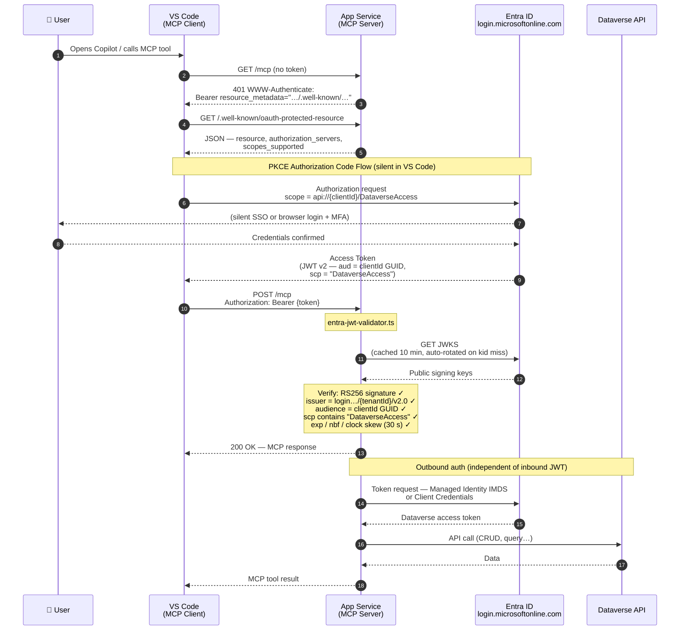

# Authentication — Entra ID JWT (Hosted MCP Server)

> **Use this when:** you deploy the MCP server as a shared HTTP endpoint on Azure (App Service,
> Container Apps…) and want each user to authenticate with **their own Entra identity** from
> VS Code, Claude, Cursor or any MCP-capable client.

---

## Architecture overview

The diagram below shows the complete request lifecycle for a VS Code user calling an MCP tool
against a server deployed on Azure App Service, using Managed Identity to reach Dataverse.



---

## Concepts & terminology

| Term                       | Where it lives                   | What it is                                                                                  |
| :------------------------- | :------------------------------- | :------------------------------------------------------------------------------------------ |
| **Entra App Registration** | Azure portal → Entra ID          | Declares the MCP server as an OAuth 2.0 resource server with its own scopes                 |
| **Application ID URI**     | App Registration → Expose an API | The `api://{clientId}` prefix used in scope strings — **NOT** in the `aud` claim            |
| **`aud` claim**            | Inside the JWT                   | Always the raw GUID (`clientId`) for v2.0 tokens — **not** `api://…`                        |
| **`scp` claim**            | Inside the JWT                   | Space-separated list of granted scopes, e.g. `"DataverseAccess"`                            |
| **Pre-authorized client**  | App Registration → Expose an API | A known public client (VS Code, Azure CLI…) exempted from user-consent prompts              |
| **JWKS**                   | Entra's OIDC key endpoint        | JSON Web Key Set — the public RSA keys used to verify token signatures                      |
| **RFC 9728**               | MCP Auth spec                    | `/.well-known/oauth-protected-resource` — tells MCP clients how to discover the auth server |
| **Managed Identity**       | Azure resource                   | Zero-secret outbound auth from App Service → Dataverse (independent of inbound JWT)         |
| **IMDS**                   | Azure VM/PaaS metadata           | The internal endpoint (`169.254.169.254`) Managed Identity uses to fetch tokens             |

---

## Critical note — `aud` GUID vs `api://` URI

> **Only use the raw GUID in `ENTRA_AUDIENCE`, never the `api://` prefix.**

Entra ID v2.0 tokens (`"ver": "2.0"`) put the **Application ID GUID** directly in `aud`:

```json
{ "aud": "8679b53c-ed29-4824-ab95-d215d0fd4b67", "ver": "2.0" }
```

The `api://` prefix appears only in **scope strings** (`api://{clientId}/DataverseAccess`).
If you set `ENTRA_AUDIENCE=api://8679b53c-…` the validator will always return HTTP 401.

---

## Prerequisites

|                                 |                                                               |
| :------------------------------ | :------------------------------------------------------------ |
| Azure subscription              | Required to create App Registration and configure App Service |
| Dataverse environment           | Licensed, accessible from Azure                               |
| App Service (or Container Apps) | Where the MCP server is hosted                                |
| `az` CLI (optional)             | Used in the verification steps below                          |

---

## Setup — step by step

### Step 1 — Create the App Registration

```bash
# Create the registration
az ad app create \
  --display-name "mcp-dataverse-server" \
  --sign-in-audience AzureADMyOrg

# Note the appId from the output (= ENTRA_CLIENT_ID)
```

In the Azure portal, open **Entra ID → App Registrations → mcp-dataverse-server**:

1. **Manifest** — set the following two properties:

   ```json
   {
     "accessTokenAcceptedVersion": 2,
     "isFallbackPublicClient": true
   }
   ```

   > `accessTokenAcceptedVersion: 2` forces v2.0 tokens (GUID in `aud`).
   > `isFallbackPublicClient: true` enables Device Code / PKCE flows for pre-authorized public clients.

2. **Expose an API** → `Application ID URI` → Set to `api://{clientId}`.

3. **Expose an API** → **Add a scope**:
   - Scope name: `DataverseAccess`
   - Who can consent: `Admins and users`
   - Display name / description: fill in as needed
   - State: **Enabled**

4. **Expose an API** → **Add a client application** — pre-authorize MCP clients so users are not prompted to consent:

   | Client                         | Client ID                              |
   | :----------------------------- | :------------------------------------- |
   | VS Code                        | `aebc6443-996d-45c2-90f0-388ff96faa56` |
   | GitHub Copilot CLI             | `aebc6443-996d-45c2-90f0-388ff96faa56` |
   | Azure CLI (testing)            | `04b07795-8ddb-461a-bbee-02f9e1bf7b46` |
   | Claude Desktop (add if needed) | your own public client app id          |

   > Check **`api://{clientId}/DataverseAccess`** for each pre-authorized client.

---

### Step 2 — Configure App Service environment variables

Set these in **App Service → Settings → Environment variables**
(or via Azure CLI / Bicep / Terraform):

| Variable               | Value                                | Notes                                                 |
| :--------------------- | :----------------------------------- | :---------------------------------------------------- |
| `ENTRA_TENANT_ID`      | `85bad2c4-…`                         | Your Entra tenant ID                                  |
| `ENTRA_CLIENT_ID`      | `8679b53c-…`                         | The `appId` of the App Registration                   |
| `ENTRA_AUDIENCE`       | `8679b53c-…`                         | **Same GUID as `ENTRA_CLIENT_ID`** — NOT `api://…`    |
| `ENTRA_REQUIRED_SCOPE` | `DataverseAccess`                    | Scope short name (no `api://` prefix)                 |
| `MCP_PUBLIC_URL`       | `https://your-app.azurewebsites.net` | Used in `/.well-known` and `WWW-Authenticate` headers |

> **`ENTRA_AUDIENCE` defaults to `api://{ENTRA_CLIENT_ID}`** when not set — which is wrong for v2.0
> tokens. Always set it explicitly to the bare GUID.

```bash
az webapp config appsettings set \
  --name YOUR_APP_NAME \
  --resource-group YOUR_RG \
  --settings \
    ENTRA_TENANT_ID="85bad2c4-4791-42da-9a21-fc843dba9033" \
    ENTRA_CLIENT_ID="8679b53c-ed29-4824-ab95-d215d0fd4b67" \
    ENTRA_AUDIENCE="8679b53c-ed29-4824-ab95-d215d0fd4b67" \
    ENTRA_REQUIRED_SCOPE="DataverseAccess" \
    MCP_PUBLIC_URL="https://your-app.azurewebsites.net"
```

---

### Step 3 — Configure outbound auth to Dataverse

The inbound JWT auth (above) is independent of how the MCP server authenticates **toward Dataverse**.
For a production App Service deployment, Managed Identity is recommended (no secrets):

1. Enable the system-assigned identity on the App Service:

   ```bash
   az webapp identity assign \
     --name YOUR_APP_NAME \
     --resource-group YOUR_RG
   # Copy the principalId from the output
   ```

2. Register the identity as a Dataverse Application User:

   ```bash
   pac admin application register --application-id <principalId>
   pac admin assign-user \
     --environment https://yourorg.crm.dynamics.com \
     --user <principalId> \
     --role "System Administrator" \
     --application-user
   ```

3. Deploy the server with `authMethod: "managed-identity"` in `config.json`.

See [auth-azure-credentials.md](auth-azure-credentials.md) if you prefer client credentials
instead of Managed Identity for the outbound Dataverse connection.

---

### Step 4 — Point your MCP client to the server

**VS Code** — create or edit `.vscode/mcp.json` in your project:

```json
{
  "servers": {
    "mcp-dataverse": {
      "type": "http",
      "url": "https://your-app.azurewebsites.net/mcp"
    }
  }
}
```

VS Code will auto-discover the Entra auth server via `/.well-known/oauth-protected-resource`,
open a browser sign-in if needed (or use silent SSO), and attach the Bearer token automatically.

**Claude Desktop** — add to `claude_desktop_config.json`:

```json
{
  "mcpServers": {
    "mcp-dataverse": {
      "command": "curl",
      "args": [
        "-s",
        "-X",
        "POST",
        "-H",
        "Authorization: Bearer TOKEN",
        "https://your-app.azurewebsites.net/mcp"
      ]
    }
  }
}
```

> Claude Desktop does not yet support dynamic Entra auth. Use the static bearer secret
> (`MCP_HTTP_SECRET`) or a pre-obtained token until OAuth support is added.

---

## Verification

### Verify the `/.well-known` endpoint

```bash
curl https://your-app.azurewebsites.net/.well-known/oauth-protected-resource
```

Expected:

```json
{
  "resource": "https://your-app.azurewebsites.net/mcp",
  "authorization_servers": [
    "https://login.microsoftonline.com/{tenantId}/v2.0"
  ],
  "bearer_methods_supported": ["header"],
  "scopes_supported": ["api://{clientId}/DataverseAccess"],
  "resource_documentation": "https://github.com/aileron-split/mcp-dataverse"
}
```

### Test with Azure CLI token

Obtain a token that mimics what VS Code would send:

```bash
TOKEN=$(az account get-access-token \
  --scope "api://8679b53c-ed29-4824-ab95-d215d0fd4b67/DataverseAccess" \
  --query accessToken -o tsv)
```

Decode and inspect the claims:

```bash
# PowerShell — inspect aud + scp
$payload = $TOKEN.Split('.')[1]
$padded  = $payload.PadRight(($payload.Length + 3) -band -bnot 3, '=')
[System.Text.Encoding]::UTF8.GetString([Convert]::FromBase64String($padded)) | ConvertFrom-Json |
  Select-Object aud, scp, iss, ver, exp
```

Expected:

```json
{
  "aud": "8679b53c-ed29-4824-ab95-d215d0fd4b67",
  "scp": "DataverseAccess",
  "iss": "https://login.microsoftonline.com/{tenantId}/v2.0",
  "ver": "2.0"
}
```

Call the MCP endpoint:

```bash
curl -s \
  -X POST "https://your-app.azurewebsites.net/mcp" \
  -H "Authorization: Bearer $TOKEN" \
  -H "Content-Type: application/json" \
  -H "Accept: application/json, text/event-stream" \
  -d '{"jsonrpc":"2.0","id":1,"method":"initialize","params":{"protocolVersion":"2024-11-05","capabilities":{},"clientInfo":{"name":"test","version":"1.0"}}}'
```

Expected HTTP 200 with MCP `initialize` response.

---

## Troubleshooting

| Symptom                                               | Cause                                                 | Fix                                                                        |
| :---------------------------------------------------- | :---------------------------------------------------- | :------------------------------------------------------------------------- |
| 401 `JWTClaimValidationFailed: unexpected "aud"`      | `ENTRA_AUDIENCE` set to `api://…`                     | Change to the bare GUID                                                    |
| 401 `JWTExpired`                                      | Token older than its `exp` claim                      | Request a new token                                                        |
| 401 `JWTClaimValidationFailed: unexpected "iss"`      | Wrong `ENTRA_TENANT_ID`                               | Check your tenant ID in the Azure portal                                   |
| 401 `Required scope '…' not present`                  | Scope mismatch — `scp` ≠ `ENTRA_REQUIRED_SCOPE`       | Verify scope name in App Registration, check pre-authorization             |
| VS Code shows "Failed to discover auth server"        | `MCP_PUBLIC_URL` missing or incorrect                 | Set to the public HTTPS URL of the App Service                             |
| User consent prompt appears despite pre-authorization | Client app ID not in pre-authorized list              | Add the VS Code app ID to "Expose an API → Authorized client applications" |
| 403 on Dataverse calls (outbound)                     | Managed Identity not registered as Dataverse App User | Run `pac admin application register` + assign role                         |

---

## Annexe — Technical internals

### JWT validation pipeline (`entra-jwt-validator.ts`)

```
1. Extract Bearer token from Authorization header
2. Decode header → extract `kid` (key ID) — no signature check yet
3. createRemoteJWKSet fetches https://login.microsoftonline.com/{tenantId}/discovery/v2.0/keys
   └── Cache: 10 min (configurable) | auto-refresh on unknown kid | 30 s cooldown
4. jose jwtVerify:
   a. Match kid → public key from JWKS
   b. Verify RS256 signature
   c. Check issuer = "https://login.microsoftonline.com/{tenantId}/v2.0"
   d. Check audience = ENTRA_AUDIENCE (GUID)
   e. Check nbf ≤ now ≤ exp  (±30 s clock tolerance)
5. (Optional) Check scp claim contains ENTRA_REQUIRED_SCOPE
6. Return { oid, upn, name } — stable Entra identity properties
```

### Claims returned to the MCP server

| Claim                        | Value                  | Notes                                                          |
| :--------------------------- | :--------------------- | :------------------------------------------------------------- |
| `oid`                        | User's Entra Object ID | Stable, unique per user per tenant — use as principal identity |
| `upn` / `preferred_username` | `alice@contoso.com`    | Human-readable but can change                                  |
| `name`                       | Alice Smith            | Display name, for logging only                                 |
| `scp`                        | `DataverseAccess`      | Scope(s) granted to this token                                 |
| `appid` / `azp`              | Client app ID          | Which client obtained the token (VS Code, CLI…)                |
| `ver`                        | `2.0`                  | Always v2.0 when `accessTokenAcceptedVersion: 2` in manifest   |

### JWKS caching behaviour

```
First request → JWKS fetched from Entra
         └── Cached (10 min TTL)
Unknown kid  → Immediate refetch (one refetch per 30 s cooldown)
         └── Prevents amplification on forged tokens
```

### Dual-mode auth fallback

`http-server.ts` supports both auth modes simultaneously:

```
ENTRA_TENANT_ID + ENTRA_CLIENT_ID set?
  YES → validate as Entra JWT
  NO  → MCP_HTTP_SECRET set?
          YES → compare to Bearer token (HMAC-SHA256, timing-safe)
          NO  → all requests accepted (development only — never in production)
```

The static bearer (`MCP_HTTP_SECRET`) works for non-OAuth clients (Claude Desktop, scripts).
The Entra JWT mode works for VS Code and any PKCE-capable client.
Both can coexist: Entra-capable clients use JWT; legacy clients use the shared secret.

---

## See also

- [auth-device-code.md](auth-device-code.md) — local development, no App Registration required
- [auth-azure-credentials.md](auth-azure-credentials.md) — service principal / CI-CD outbound auth
- [auth-testing-guide.md](auth-testing-guide.md) — quick comparison of all three outbound methods
