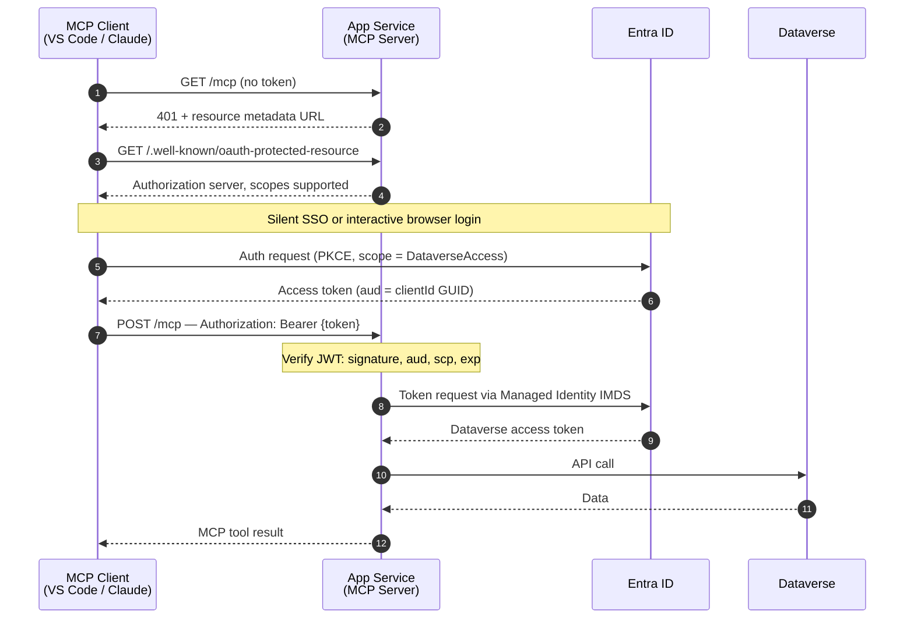

# Managed Identity — Hosted MCP Server

Deploy MCP Dataverse as a shared HTTP endpoint on Azure. The server authenticates to Dataverse
using its Azure Managed Identity. Users connect to the server with their own Entra identity.

**Intended for:** team deployments, enterprise setups, shared multi-user access.  
**Hosting:** Azure App Service or Azure Container Apps.

---

## Two authentication layers

| Layer | Direction | Who authenticates | Protocol |
|:------|:----------|:-----------------|:---------|
| **Inbound** | Client → MCP server | Each user's Entra account | Bearer JWT (validated by the server) |
| **Outbound** | MCP server → Dataverse | Server's Azure Managed Identity | OAuth 2.0 (handled by Azure IMDS) |

> **Important:** Dataverse is called using the server's Managed Identity, not the connecting
> user's identity. Dataverse permissions are those of the **Application User assigned to the
> Managed Identity** — not the individual user's Dataverse roles.

### Request flow



---

## Azure Platform Setup

> Performed once by an Azure or Entra administrator.

### 1. Create the App Registration

```bash
az ad app create \
  --display-name "mcp-dataverse-server" \
  --sign-in-audience AzureADMyOrg
# Note the appId from the output
```

In the Azure portal (**Entra ID → App Registrations → mcp-dataverse-server**):

**Manifest** — set:

```json
{
  "accessTokenAcceptedVersion": 2,
  "isFallbackPublicClient": true
}
```

**Expose an API:**

1. Application ID URI → set to `api://<appId>`
2. Add scope `DataverseAccess` (Admins and users, Enabled)
3. Pre-authorize these clients (users won't see a consent prompt):

| Client | Application ID |
|:-------|:--------------|
| VS Code | `aebc6443-996d-45c2-90f0-388ff96faa56` |
| Azure CLI (testing) | `04b07795-8ddb-461a-bbee-02f9e1bf7b46` |

> These are **Microsoft's own first-party Application IDs** — identical across every Entra tenant worldwide. Copy them as-is; do not substitute your own values.

### 2. Configure the App Service

Set environment variables in **App Service → Settings → Environment variables**:

| Variable | Value |
|:---------|:------|
| `ENTRA_TENANT_ID` | Your Entra tenant ID |
| `ENTRA_CLIENT_ID` | App Registration `appId` |
| `ENTRA_AUDIENCE` | Same GUID as `ENTRA_CLIENT_ID` — **not** `api://…` |
| `ENTRA_REQUIRED_SCOPE` | `DataverseAccess` |
| `MCP_PUBLIC_URL` | `https://your-app.azurewebsites.net` |

> `ENTRA_AUDIENCE` must be the bare GUID. Setting it to `api://…` causes HTTP 401 on every
> inbound request.

Using Azure CLI:

```bash
az webapp config appsettings set \
  --name YOUR_APP_NAME --resource-group YOUR_RG \
  --settings \
    ENTRA_TENANT_ID="<tenantId>" \
    ENTRA_CLIENT_ID="<appId>" \
    ENTRA_AUDIENCE="<appId>" \
    ENTRA_REQUIRED_SCOPE="DataverseAccess" \
    MCP_PUBLIC_URL="https://your-app.azurewebsites.net"
```

`config.json` on the server:

```json
{
  "environmentUrl": "https://yourorg.crm.dynamics.com",
  "authMethod": "managed-identity"
}
```

### 3. Enable Managed Identity and register in Dataverse

```bash
az webapp identity assign --name YOUR_APP_NAME --resource-group YOUR_RG
# Copy the principalId from the output

pac admin application register --application-id <principalId>

pac admin assign-user \
  --environment https://yourorg.crm.dynamics.com \
  --user <principalId> \
  --role "System Administrator" \
  --application-user
```

---

## Developer Connection

> Performed by each developer who wants to use the hosted server.

Add to `.vscode/mcp.json` in your project:

```json
{
  "servers": {
    "mcp-dataverse": {
      "type": "http",
      "url": "https://your-app.azurewebsites.net/mcp"
    }
  }
}
```

VS Code automatically discovers the Entra login server via `/.well-known/oauth-protected-resource`,
performs a silent SSO login, and attaches the Bearer token on each request.

For other MCP clients, see [Multi-Client Setup — Hosted Server]({{ site.baseurl }}/multi-client-setup#hosted-server).

---

## Verify

Check the discovery endpoint:

```bash
curl https://your-app.azurewebsites.net/.well-known/oauth-protected-resource
```

Test with an Azure CLI token:

```bash
TOKEN=$(az account get-access-token \
  --scope "api://<appId>/DataverseAccess" \
  --query accessToken -o tsv)

curl -s -X POST "https://your-app.azurewebsites.net/mcp" \
  -H "Authorization: Bearer $TOKEN" \
  -H "Content-Type: application/json" \
  -H "Accept: application/json, text/event-stream" \
  -d '{"jsonrpc":"2.0","id":1,"method":"initialize","params":{"protocolVersion":"2024-11-05","capabilities":{},"clientInfo":{"name":"test","version":"1.0"}}}'
```

Expected: HTTP 200 with MCP `initialize` response.

---

## Troubleshooting

| Symptom | Cause | Fix |
|:--------|:------|:----|
| 401 `JWTClaimValidationFailed: unexpected "aud"` | `ENTRA_AUDIENCE` set to `api://…` | Change to the bare GUID |
| 401 `JWTExpired` | Token expired | Re-obtain token |
| 401 `Required scope not present` | Scope name mismatch | Verify scope name in App Registration |
| VS Code "Failed to discover auth server" | `MCP_PUBLIC_URL` missing or wrong | Set to the public HTTPS URL of the App Service |
| Consent prompt appears (should be silent) | VS Code not in pre-authorized list | Add VS Code app ID to **Expose an API → Authorized client applications** |
| 403 on Dataverse calls | Managed Identity not registered as App User | Run `pac admin application register` + assign role |
